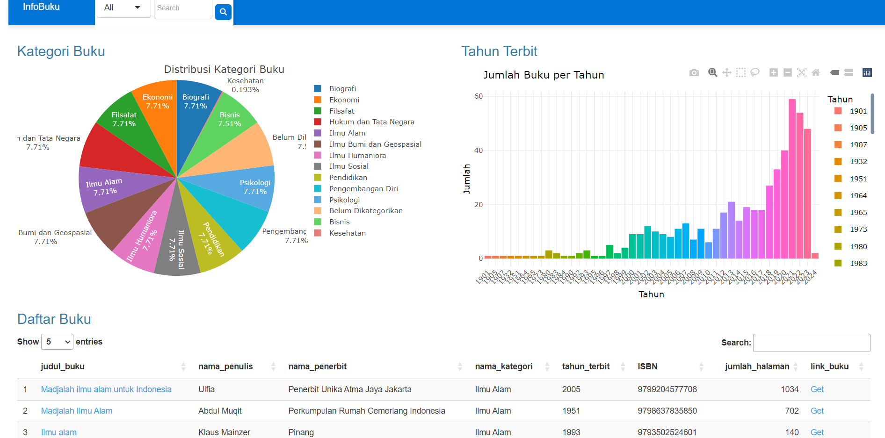
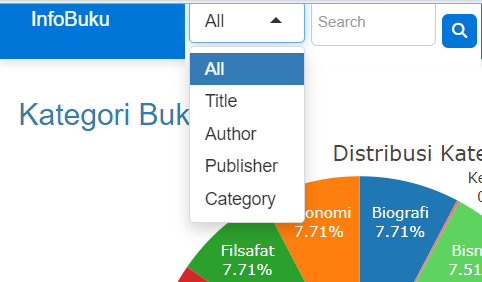
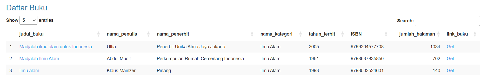
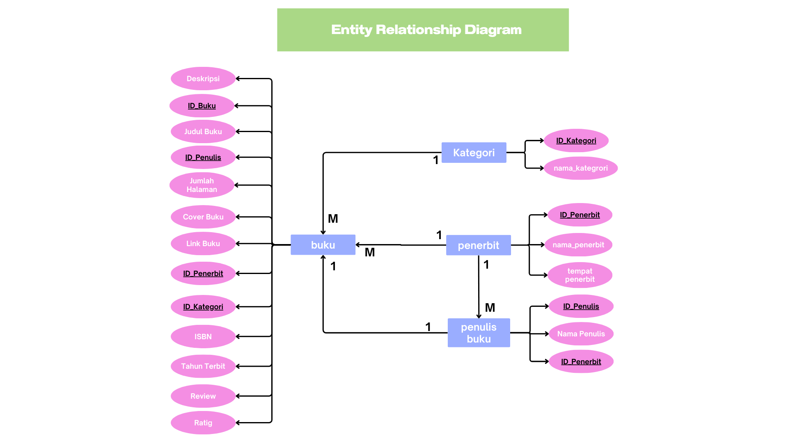

<p align="center">
  
</p>

<div align="center">

# bukupedia
# _"Cari Buku? Tenang, di sini nggak bakal ada plot twist kayak di hidupmu."_
</div>

## :bookmark_tabs: Menu

- [About](#clipboard-About)
- [Screenshot](#camera-Screenshot)
- [Demo](#card_file_box-Demo)
- [Requirements](#exclamation-Requirements)
- [Database Scheme](#floppy_disk-Database-Scheme)
- [ERD](#rotating_light-ERD)
- [Data Description](#heavy_check_mark-Data-Description)
- [Folder Structure](#open_file_folder-Folder-Structure)
- [Our Team](#heavy_heart_exclamation-Our-Team)

## :clipboard: About
### **Project Description - Book Management Web Application**  

This project is a **web-based book database management system** that enables users to efficiently search, categorize, and analyze book data sourced from Google Books. The platform provides an intuitive and structured interface for users to explore book references based on various criteria.  

### **Key Features:**  
📚 **Book Categories Distribution** – Visual representation of book categories to help users identify trends in various fields.  
📊 **Publication Year Analysis** – A bar chart showcasing the number of books published each year, making it easier to analyze publication trends.  
🔍 **Advanced Book Search** – Users can search for books based on title, author, publisher, category, or publication year.  
📖 **Detailed Book Information** – Each book entry includes **title, author, publisher, category, publication year, page count, and ISBN**, along with a direct link for reference.  
📈 **Statistical Insights** – Users can explore books with the **most pages**, calculate **average pages in a specific category**, and identify **publishers with the highest number of book releases**.  

This application serves as a valuable tool for **students, researchers, and book enthusiasts**, making it easier to discover and analyze book-related data for educational and research purposes.  

## :camera: Screenshot
<p align="center">
  
</p>

The dashboard provides a visual overview of book data, including a pie chart of category distribution, a bar chart of publication trends, and a searchable table of book details such as title, author, publisher, year, ISBN, and page count. Users can efficiently explore book references, analyze trends, and access direct links for further reading.

<p align="center">
  
</p>

The dropdown menu in the search bar allows users to filter book searches based on specific criteria. Users can choose "Title" to search by book title, "Author" to find books by a specific writer, "Publisher" to filter by publishing house, or "Category" to browse books based on their genre. Selecting "All" enables a broader search across all available fields. This feature helps users quickly locate relevant books based on their preferred search method.

<p align="center">
  
</p>

The search bar in the Daftar Buku (Book List) section allows users to search for books based on any available information in the table. Users can enter a book title, author name, publisher, category, publication year, ISBN, or page count to quickly filter and find specific books. This feature makes it easy to locate relevant books without manually browsing through the entire list.

## :card_file_box: Demo

## :exclamation: Requirements

## :floppy_disk: Database Scheme

## :rotating_light: ERD
The **Entity-Relationship Diagram (ERD)** illustrates the database structure of the book management system, showcasing the relationships between key entities such as **books, authors, publishers, and categories**. This diagram helps in understanding how data is organized, stored, and connected, ensuring efficient retrieval and management of book-related information within the application.

<p align="center">
  
</p>

## :heavy_check_mark: Data Description

Contains the tables and SQL DDL (CREATE) syntax.

### :abacus: Create Database  
The **Bukupedia** database stores information that represents interconnected book-related attributes, including **titles, authors, publishers, categories, and publication details**, ensuring efficient data management and retrieval for book searches and analysis.

```sql
# Konfigurasi Database DBngin
db_config <- list(
 host = "127.0.0.1",
  port = 3306,          # Port MySQL di DBngin
  user = "root",
  password = "",
  dbname = "mds_db_buku"    # Nama database yang akan dibuat
)

# Membuat Database
tryCatch({
  dbExecute(con, glue("CREATE DATABASE IF NOT EXISTS {db_config$dbname}"))
  message("Database ", db_config$dbname, " berhasil dibuat/ditemukan")
}, error = function(e) {
  message("Gagal membuat database: ", e$message)
})
```

### :books: Create Table Book 
The **Book** table provides users with detailed information about books available in **Bukupedia**. Users can access essential details such as **book ID, title, author, publisher, category, publication year, ISBN, page count, and a reference link**. This table serves as the core of the book database, enabling efficient book searches and management. Here is a description for each column in the **Book** table.

| Attribute                  | Type                   | Description                     		                  |
|:---------------------------|:-----------------------|:------------------------------------------------------|
| id_buku                    | character varying(20)  | Unique identifier for each book  		                  |
| judul_buku                 | character varying(255) | Title of the book              	  	                  |
| id_penulis                 | character varying(20)	| Identifier for the author of the book                 |	
| id_penerbit                | character varying(20)  | Identifier for the publisher of the book              |
| id_kategori	               | character varying(20)  | Identifier for the book's category/genre              |
| ISBN		    	             | character varying(50)  | International Standard Book Number (ISBN)             |
| tahun_terbit		    	     | character varying(50)  | Year the book was published                           |
| Reviewer		        	     | character varying(50)  | Number of users who have reviewed the book            |
| rating		    	           | character varying(50)  | Book rating based on reviews or user feedback         |
| jumlah_halaman		    	   | integer                | Total number of pages in the book                     |
| link_buku		    	         | text                   | Direct link to the book reference or source           |
| deskripsi		    	         | text                   | Short description or summary of the book              |
| coverurl	    	           | text                   | URL of the book cover image                           |

```sql
buku = "
    CREATE TABLE IF NOT EXISTS buku (
      id_buku VARCHAR(20) PRIMARY KEY,
      judul_buku VARCHAR(255),
      id_penulis VARCHAR(20),
      id_penerbit VARCHAR(20),
      id_kategori VARCHAR(20),
      ISBN VARCHAR(50),
      tahun_terbit VARCHAR(50),
      Reviewer VARCHAR(50),
      rating VARCHAR(50),
      jumlah_halaman INT,
      link_buku TEXT,
      deskripsi TEXT,
      coverurl TEXT
    )
  "
```

### :file_folder: Create Table Category 
The **Category** table stores information about the different book categories available in **Bukupedia**. It consists of a **unique category ID** and a **category name**, which help classify books into specific genres or subjects. This table ensures that books can be easily organized and searched based on their respective categories. Below is a description of the **Category** table.

| Attribute                  | Type                   | Description                     		                  |
|:---------------------------|:-----------------------|:------------------------------------------------------|
| id_kategori                | character varying(20)  | Unique identifier for each book category              |
| nama_kategori              | character varying(255) | Name of the book category      	  	                  |

```sql
  kategori = "
    CREATE TABLE IF NOT EXISTS kategori (
      id_kategori VARCHAR(20) PRIMARY KEY,
      nama_kategori VARCHAR(255)
    )
  "
```

### :office: Create Table Publisher
The Publisher table stores information about the different book publishers available in Bukupedia. It consists of a unique publisher ID and a publisher name, which help categorize books based on their respective publishing houses. This table ensures that books can be easily filtered and searched according to their publishers. Below is a description of the Publisher table.

| Attribute                  | Type                   | Description                     		                  |
|:---------------------------|:-----------------------|:------------------------------------------------------|
| id_penerbit                | character varying(20)  | Unique identifier for each publisher                  |
| nama_penerbit              | character varying(255) | Name of the publisher         	  	                  |
| tempat_penerbit            | character varying(255) | Location or place where the publisher is based        |

```sql
penerbit = "
    CREATE TABLE IF NOT EXISTS penerbit (
      id_penerbit VARCHAR(20) PRIMARY KEY,
      nama_penerbit VARCHAR(255),
      tempat_penerbit VARCHAR(255)
    )
  "
```

### :memo: Create Table Author
The Author table stores information about the different book authors available in Bukupedia. It consists of a unique author ID, an author name, and an author's nationality, which help categorize books based on their respective writers. This table ensures that books can be easily filtered and searched according to their authors. Below is a description of the Author table.

| Attribute                  | Type                   | Description                     		                  |
|:---------------------------|:-----------------------|:------------------------------------------------------|
| id_penulis                 | character varying(20)  | Unique identifier for each author                     |
| nama_penulis               | character varying(255) | Name of the author            	  	                  |
| id_penerbit                | character varying(20)  | Unique identifier for each publisher                  |

```sql
penulis = "
    CREATE TABLE IF NOT EXISTS penulis (
      id_penulis VARCHAR(20) PRIMARY KEY,
      nama_penulis VARCHAR(255),
      id_penerbit VARCHAR(20),
      FOREIGN KEY (id_penerbit) REFERENCES penerbit(id_penerbit)
    )
  "
```

## :open_file_folder: Folder Structure
```
📂 MDS-DataBuku
├── 📁 Connection
│    ├── 📄 data_buku.Rmd
├── 📁 Data
│    ├── 📄 Data_Buku.csv
│    ├── 📄 InformasiTambahan.xlsx
│    ├── 📄 kategori buku.csv
│    ├── 📄 penerbit buku.csv
│    ├── 📄 penulis buku.csv
├── 📁 image
│    ├── 📄 ERD_1.png
│    ├── 📄 booklist
│    ├── 📄 dashboard
│    ├── 📄 dropdown
│    ├── 📄 heaader.png
│    ├── 📄 team.png
├── 📁 literatur_elektronik
│    ├── 📄 app.R
├── 📄 .gitignore
├── 📄 MDS-najih.Rproj
├── 📄 README.md
└── 📄 app.R
```

## :star2: Our Team
<p align="center">
  
</p>
